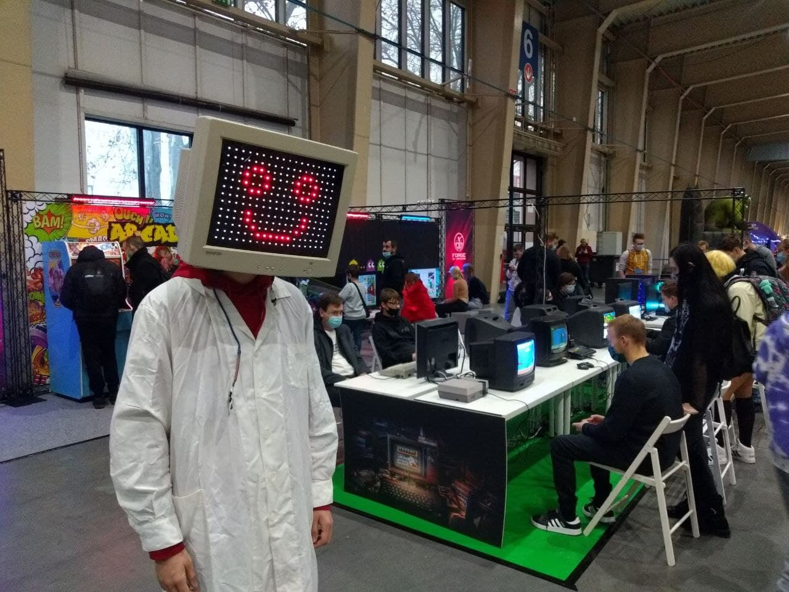

# Arduino-WS2812B-screen

Small personal project to showoff my skills. It is made of WS2812B Led strip that resembles LCD screen.

Features:
- variety of static and animated images
- games: snake, arkanoid, tetris
- glitch mode
- some of the images react to pressing buttons

